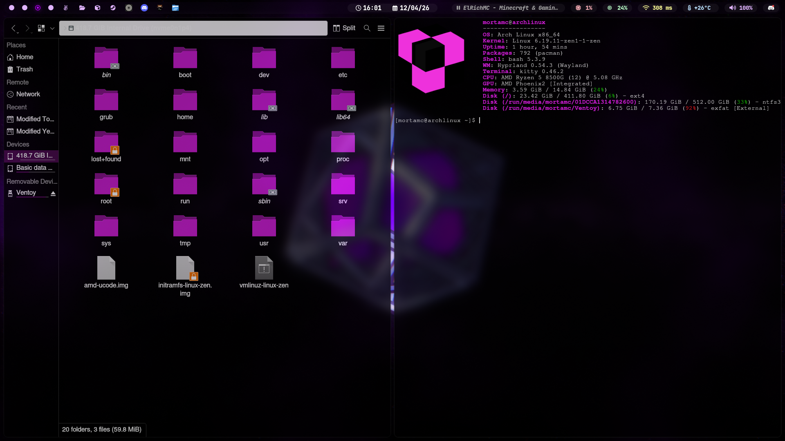

# 💎 mortfiles
My personal **Arch Linux** dotfiles with **Hyprland**, optimized for productivity and aesthetics.

## 📸 Preview



## 🛠️ Core Components
* **WM:** Hyprland
* **Bar:** Waybar
* **Terminal:** Kitty
* **Launcher:** Fuzzel / Rofi
* **Fetch:** Fastfetch (with custom logo)

## 🚀 Quick Install
To apply these dotfiles on a new system, run the following commands:

```bash
git clone [https://github.com/mortamc/mortfiles.git](https://github.com/mortamc/mortfiles.git)
cd mortfiles
chmod +x install.sh
./install.sh
